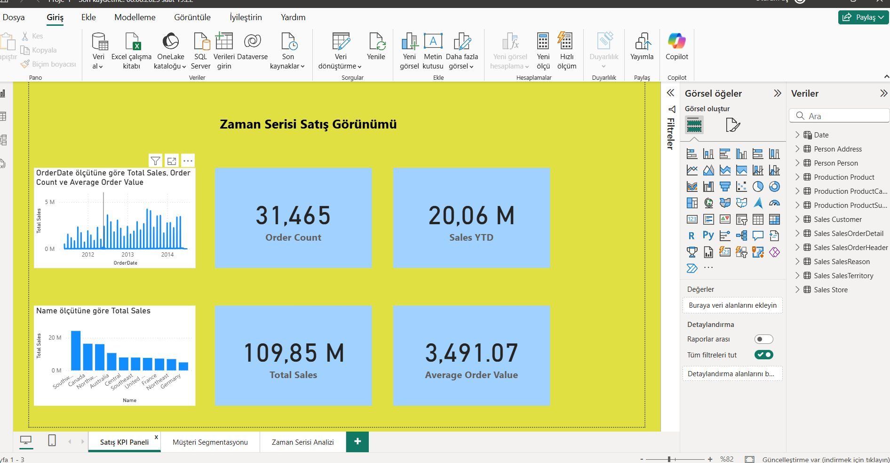
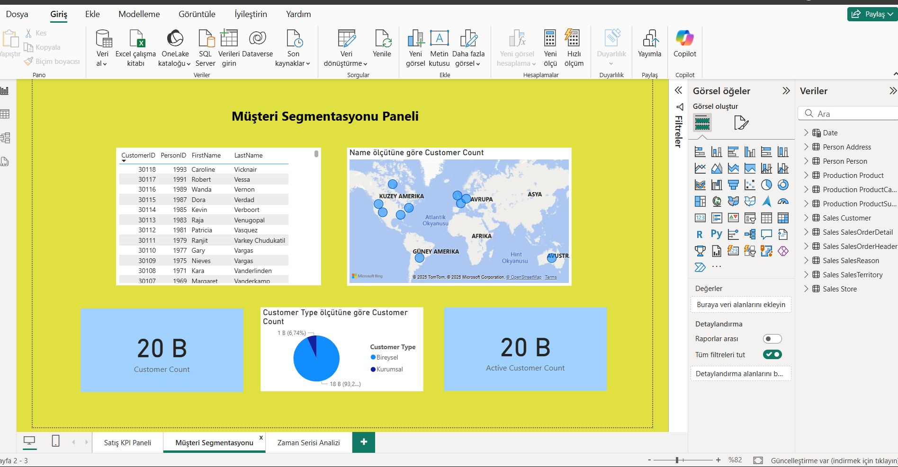
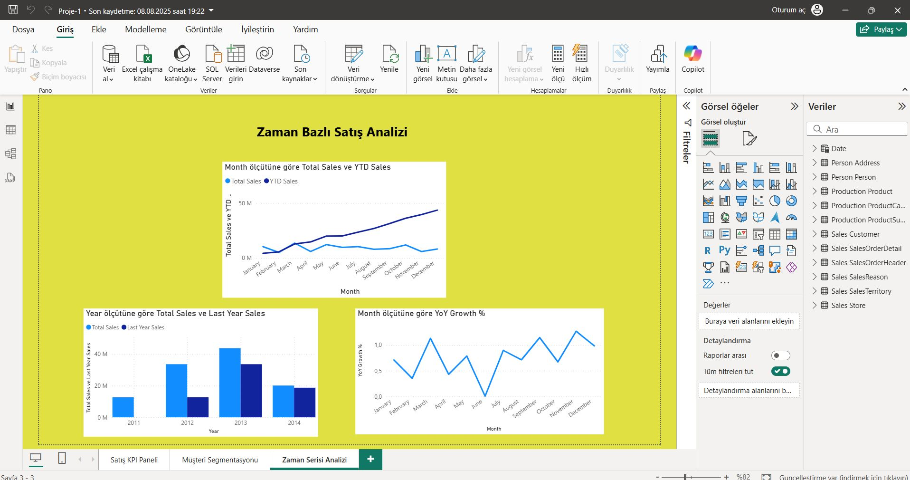

# Power BI – AdventureWorks2022 Satış Analizi

Bu proje, Microsoft’un **AdventureWorks2022** örnek veritabanını kullanarak geliştirdiğim üç sayfalı bir Power BI dashboard çalışmasıdır.  
Amaç: Satış verilerini farklı açılardan analiz edip interaktif görselleştirmeler sunmaktır.

## 📊 İçerik
1. **KPI Paneli** → Toplam satış, sipariş adedi, YTD satış, YoY büyüme
2. **Müşteri Segmentasyonu** → Kurumsal/bireysel dağılım, aktif müşteri sayısı, harita görselleştirme
3. **Zaman Serisi Analizi** → Yıllara ve aylara göre satış trendleri, YoY karşılaştırma

## 🛠️ Teknik Adımlar
- SQL Server üzerindeki AdventureWorks2022 veritabanına bağlanıldı  
- Power BI üzerinden veri modeli kuruldu  
- DAX ölçüleri ile hesaplamalar yapıldı  
- Görsel tasarım ve filtreleme özellikleri uygulandı  

## 📂 Dosyalar
- `Proje-1.pbix` → Orijinal Power BI dosyası  
- `Proje-1.pbit` → Template (opsiyonel, veri içermez)  
- `screenshots/` → Dashboard ekran görüntüleri  

## 🔍 Önizleme
*(Görselleri yükledikten sonra buraya görünecek)*  

## 🚀 Çalıştırma
1. AdventureWorks2022’yi SQL Server’a yükleyin  
2. `Proje-1.pbix` dosyasını açın  
3. Veri kaynağı sunucu adını kendi ortamınıza göre güncelleyin  
4. **Refresh** yaparak dashboard’u kullanın  

## 📄 Lisans
MIT
